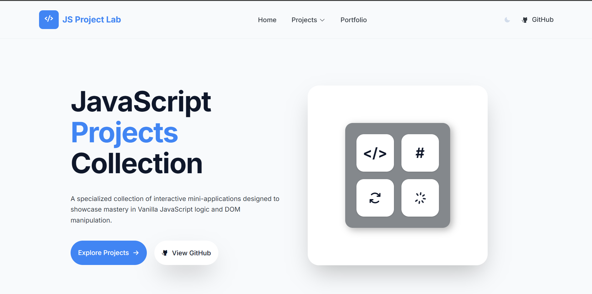
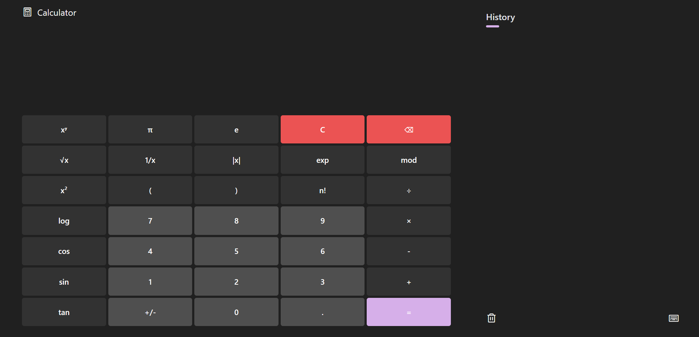

# 🕹️ JS Arcade

A growing collection of interactive, responsive web applications built entirely from scratch to master **Vanilla JavaScript, HTML, and Tailwind CSS**—without the reliance on frontend frameworks or libraries. 




This repository serves as a showcase of clean architecture, data-driven UI design, advanced DOM manipulation, and responsive layouts.

🔗 **[Live Demo: Explore the JS Arcade](https://javascript-arcade-gold.vercel.app/)**

---

## 📂 The Projects Vault

Below is the directory of applications currently available in the arcade. 

### 🧮 1. Dynamic Calculator (`/projects/calculator`)
A fully responsive, scalable calculator that processes complex mathematics including trigonometric functions, factorials, and logarithms.



**Tech Highlights:**
- **Data-Driven UI:** Buttons and shortcut menus are generated dynamically from a single JavaScript array, eliminating hardcoded HTML blocks.
- **Event Delegation:** Optimized performance with a single event listener handling all user interactions.
- **Accessibility:** Full keyboard mapping (`keydown` events) for seamless typing alongside standard mouse clicks.
- **Custom Math Engine:** A centralized `handleInput` function processes multi-step mathematical strings and handles degree-to-radian conversions natively.


## 🛠️ Global Tech Stack

- **Frontend:** HTML5, CSS3 (Custom Variables, Flexbox, Grid),, Tailwind CSS
- **Logic:** Vanilla JavaScript (ES6+)
- **Architecture:** Component-based file structure, Event Delegation, Dynamic DOM rendering
- **Assets:** Phosphor Icons

## 🚀 Running Locally

To explore these projects on your local machine:

1. Clone the repository:
   ```bash
   git clone https://github.com/khalilkhancodes/JS-Arcade.git
